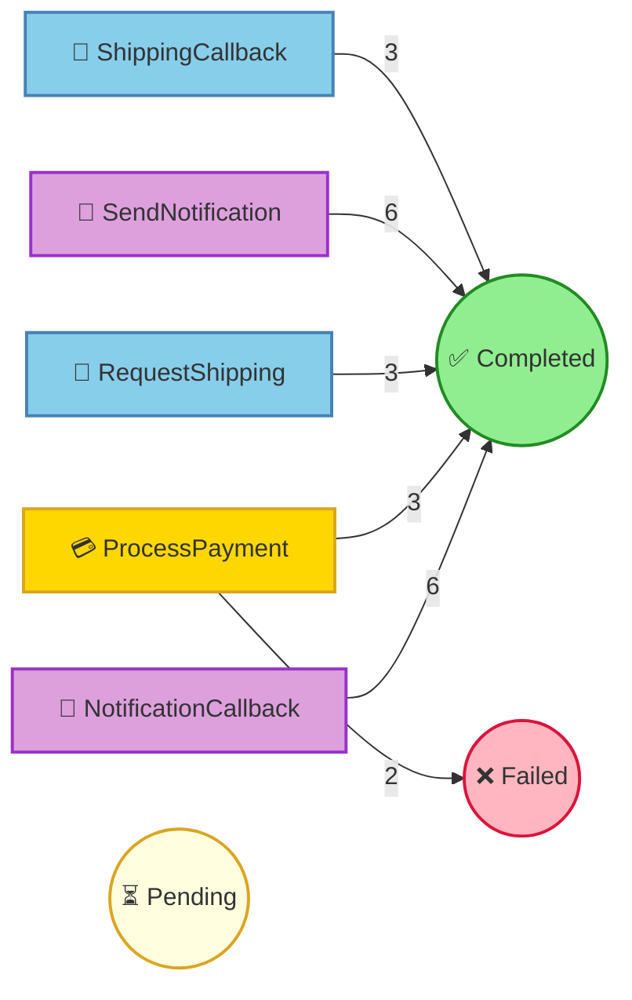

# Pet Store Command Processing Report

## Summary

| Status | Count |
|--------|-------|
| ⏳ Pending | 0 |
| ⚙️ Processing | 0 |
| ✅ Completed | 21 |
| ❌ Failed | 2 |
| ⏭️ Skipped | 0 |

## Command Flow

## Commands by Instance

### Instance: 1

| # | Command | Status | Attempts | Enqueued |
|---|---------|--------|----------|----------|
| 1 | ProcessPayment(orderId=1, customerId={redacted}, customerName={redacted}, petName=Hoppy, amount=100.0, paymentMethod={redacted}) | ❌ Failed | 1 | 16:50:04.279 |
|   | ↳ Error: FraudCheckFailed |   |   |   |

### Instance: 2

| # | Command | Status | Attempts | Enqueued |
|---|---------|--------|----------|----------|
| 2 | ProcessPayment(orderId=2, customerId={redacted}, customerName={redacted}, petName=Hoppy, amount=100.0, paymentMethod={redacted}) | ✅ Completed | 1 | 16:50:05.545 |
| 3 | RequestShipping(orderId=2, petName=Hoppy, customerName={redacted}, customerAddress={redacted}, correlationId=4f3520d9-1270-46cd-ab83-215a53842e4e) | ✅ Completed | 1 | 16:50:05.783 |
| 4 | SendNotification(orderId=2, customerEmail={redacted}, customerName={redacted}, petName=Hoppy, notificationType=order_confirmed, messageId=937ebdbe-1066-4b19-8636-88dac73cafed) | ✅ Completed | 1 | 16:50:05.783 |
| 6 | NotificationCallback(messageId=937ebdbe-1066-4b19-8636-88dac73cafed, delivered=true, error=None) | ✅ Completed | 1 | 16:50:06.820 |
| 7 | ShippingCallback(correlationId=4f3520d9-1270-46cd-ab83-215a53842e4e, trackingNumber=TRACK-450056, carrier=FurryFriends Delivery, estimatedDelivery=4 business days, success=true, error=None) | ✅ Completed | 1 | 16:50:06.855 |
| 8 | SendNotification(orderId=2, customerEmail={redacted}, customerName={redacted}, petName=Hoppy, notificationType=shipped, messageId=937ebdbe-1066-4b19-8636-88dac73cafed-shipped) | ✅ Completed | 1 | 16:50:07.044 |
| 9 | NotificationCallback(messageId=937ebdbe-1066-4b19-8636-88dac73cafed-shipped, delivered=true, error=None) | ✅ Completed | 1 | 16:50:07.761 |

### Instance: 3

| # | Command | Status | Attempts | Enqueued |
|---|---------|--------|----------|----------|
| 5 | ProcessPayment(orderId=3, customerId={redacted}, customerName={redacted}, petName=Buddy, amount=250.0, paymentMethod={redacted}) | ❌ Failed | 1 | 16:50:06.806 |
|   | ↳ Error: InsufficientFunds |   |   |   |

### Instance: 4

| # | Command | Status | Attempts | Enqueued |
|---|---------|--------|----------|----------|
| 10 | ProcessPayment(orderId=4, customerId={redacted}, customerName={redacted}, petName=Whiskers, amount=150.0, paymentMethod={redacted}) | ✅ Completed | 1 | 16:50:08.066 |
| 11 | RequestShipping(orderId=4, petName=Whiskers, customerName={redacted}, customerAddress={redacted}, correlationId=404ff617-6e3b-47b9-872f-f0232b0ba623) | ✅ Completed | 1 | 16:50:08.319 |
| 12 | SendNotification(orderId=4, customerEmail={redacted}, customerName={redacted}, petName=Whiskers, notificationType=order_confirmed, messageId=fd2c76e1-23c0-4438-9933-e48a857d4346) | ✅ Completed | 1 | 16:50:08.319 |
| 13 | NotificationCallback(messageId=fd2c76e1-23c0-4438-9933-e48a857d4346, delivered=true, error=None) | ✅ Completed | 1 | 16:50:09.104 |
| 15 | ShippingCallback(correlationId=404ff617-6e3b-47b9-872f-f0232b0ba623, trackingNumber=TRACK-206515, carrier=FurryFriends Delivery, estimatedDelivery=3 business days, success=true, error=None) | ✅ Completed | 1 | 16:50:09.679 |
| 18 | SendNotification(orderId=4, customerEmail={redacted}, customerName={redacted}, petName=Whiskers, notificationType=shipped, messageId=fd2c76e1-23c0-4438-9933-e48a857d4346-shipped) | ✅ Completed | 1 | 16:50:10.032 |
| 21 | NotificationCallback(messageId=fd2c76e1-23c0-4438-9933-e48a857d4346-shipped, delivered=true, error=None) | ✅ Completed | 1 | 16:50:10.973 |

### Instance: 5

| # | Command | Status | Attempts | Enqueued |
|---|---------|--------|----------|----------|
| 14 | ProcessPayment(orderId=5, customerId={redacted}, customerName={redacted}, petName=Tweety, amount=75.0, paymentMethod={redacted}) | ✅ Completed | 1 | 16:50:09.328 |
| 16 | RequestShipping(orderId=5, petName=Tweety, customerName={redacted}, customerAddress={redacted}, correlationId=7581ab60-bc5e-4a6c-a4f9-55a07adca01e) | ✅ Completed | 1 | 16:50:09.730 |
| 17 | SendNotification(orderId=5, customerEmail={redacted}, customerName={redacted}, petName=Tweety, notificationType=order_confirmed, messageId=5e64a290-b8bc-4ef5-80de-e48ac6980a62) | ✅ Completed | 1 | 16:50:09.731 |
| 19 | NotificationCallback(messageId=5e64a290-b8bc-4ef5-80de-e48ac6980a62, delivered=true, error=None) | ✅ Completed | 1 | 16:50:10.470 |
| 20 | ShippingCallback(correlationId=7581ab60-bc5e-4a6c-a4f9-55a07adca01e, trackingNumber=TRACK-351714, carrier=FurryFriends Delivery, estimatedDelivery=5 business days, success=true, error=None) | ✅ Completed | 1 | 16:50:10.913 |
| 22 | SendNotification(orderId=5, customerEmail={redacted}, customerName={redacted}, petName=Tweety, notificationType=shipped, messageId=5e64a290-b8bc-4ef5-80de-e48ac6980a62-shipped) | ✅ Completed | 1 | 16:50:10.984 |
| 23 | NotificationCallback(messageId=5e64a290-b8bc-4ef5-80de-e48ac6980a62-shipped, delivered=true, error=None) | ✅ Completed | 1 | 16:50:11.789 |

