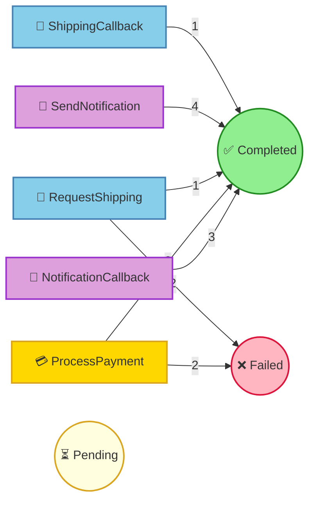

# Pet Store Command Processing Report

## Summary

| Status | Count |
|--------|-------|
| ⏳ Pending | 0 |
| ⚙️ Processing | 0 |
| ✅ Completed | 12 |
| ❌ Failed | 4 |
| ⏭️ Skipped | 0 |

## Command Flow

## Commands by Instance

### Instance: 1

| # | Command | Status | Attempts | Enqueued |
|---|---------|--------|----------|----------|
| 1 | ProcessPayment(orderId=1, customerId={redacted}, customerName={redacted}, petName=Hoppy, amount=100.0, paymentMethod={redacted}) | ✅ Completed | 2 | 15:35:30.226 |
| 6 | RequestShipping(orderId=1, petName=Hoppy, customerName={redacted}, customerAddress={redacted}, correlationId=148df28b-dfc2-4908-8463-32bc0ea6534d) | ✅ Completed | 1 | 15:35:32.407 |
| 7 | SendNotification(orderId=1, customerEmail={redacted}, customerName={redacted}, petName=Hoppy, notificationType=order_confirmed, messageId=882de6b8-a8e9-4406-be82-f51b151d06fc) | ✅ Completed | 1 | 15:35:32.407 |
| 10 | NotificationCallback(messageId=882de6b8-a8e9-4406-be82-f51b151d06fc, delivered=true, error=None) | ✅ Completed | 1 | 15:35:33.133 |
| 11 | ShippingCallback(correlationId=148df28b-dfc2-4908-8463-32bc0ea6534d, trackingNumber=TRACK-75310, carrier=AnimalCare Logistics, estimatedDelivery=2 business days, success=true, error=None) | ✅ Completed | 1 | 15:35:33.742 |
| 12 | SendNotification(orderId=1, customerEmail={redacted}, customerName={redacted}, petName=Hoppy, notificationType=shipped, messageId=882de6b8-a8e9-4406-be82-f51b151d06fc-shipped) | ✅ Completed | 1 | 15:35:33.817 |

### Instance: 2

| # | Command | Status | Attempts | Enqueued |
|---|---------|--------|----------|----------|
| 2 | ProcessPayment(orderId=2, customerId={redacted}, customerName={redacted}, petName=Buddy, amount=250.0, paymentMethod={redacted}) | ❌ Failed | 1 | 15:35:30.147 |
|   | ↳ Error: FraudCheckFailed |   |   |   |

### Instance: 3

| # | Command | Status | Attempts | Enqueued |
|---|---------|--------|----------|----------|
| 3 | ProcessPayment(orderId=3, customerId={redacted}, customerName={redacted}, petName=Tweety, amount=75.0, paymentMethod={redacted}) | ✅ Completed | 1 | 15:35:31.408 |
| 4 | RequestShipping(orderId=3, petName=Tweety, customerName={redacted}, customerAddress={redacted}, correlationId=59942544-a912-47b0-ae6a-5e3efa4a6c1b) | ❌ Failed | 1 | 15:35:31.749 |
|   | ↳ Error: AddressInvalid(Could not validate address) |   |   |   |
| 5 | SendNotification(orderId=3, customerEmail={redacted}, customerName={redacted}, petName=Tweety, notificationType=order_confirmed, messageId=b9220429-d6e6-4803-9a2a-42104d0bd07d) | ✅ Completed | 1 | 15:35:31.749 |
| 8 | NotificationCallback(messageId=b9220429-d6e6-4803-9a2a-42104d0bd07d, delivered=true, error=None) | ✅ Completed | 1 | 15:35:32.551 |

### Instance: 4

| # | Command | Status | Attempts | Enqueued |
|---|---------|--------|----------|----------|
| 9 | ProcessPayment(orderId=4, customerId={redacted}, customerName={redacted}, petName=Hoppy, amount=100.0, paymentMethod={redacted}) | ❌ Failed | 2 | 15:35:32.669 |
|   | ↳ Error: CardDeclined(Generic decline) |   |   |   |

### Instance: 5

| # | Command | Status | Attempts | Enqueued |
|---|---------|--------|----------|----------|
| 13 | ProcessPayment(orderId=5, customerId={redacted}, customerName={redacted}, petName=Whiskers, amount=150.0, paymentMethod={redacted}) | ✅ Completed | 1 | 15:35:33.931 |
| 14 | RequestShipping(orderId=5, petName=Whiskers, customerName={redacted}, customerAddress={redacted}, correlationId=87cc67f6-e8dd-49fd-98cc-6b1fdf777851) | ❌ Failed | 1 | 15:35:34.144 |
|   | ↳ Error: AddressInvalid(Could not validate address) |   |   |   |
| 15 | SendNotification(orderId=5, customerEmail={redacted}, customerName={redacted}, petName=Whiskers, notificationType=order_confirmed, messageId=2531c8ca-5fe7-4622-8c11-35a04563a525) | ✅ Completed | 1 | 15:35:34.145 |
| 16 | NotificationCallback(messageId=2531c8ca-5fe7-4622-8c11-35a04563a525, delivered=true, error=None) | ✅ Completed | 1 | 15:35:35.228 |

