# Pet Store Command Processing Report

## Summary

| Status | Count |
|--------|-------|
| ⏳ Pending | 0 |
| ⚙️ Processing | 0 |
| ✅ Completed | 20 |
| ❌ Failed | 2 |
| ⏭️ Skipped | 0 |

## Command Flow

```mermaid
flowchart LR
    cmd0["📧 NotificationCallback"]
    cmd1["💳 ProcessPayment"]
    cmd2["🚚 RequestShipping"]
    cmd3["📧 SendNotification"]
    cmd4["🚚 ShippingCallback"]

    completed(("✅ Completed"))
    failed(("❌ Failed"))
    pending(("⏳ Pending"))

    style completed fill:#90EE90,stroke:#228B22,stroke-width:2px
    style failed fill:#FFB6C1,stroke:#DC143C,stroke-width:2px
    style pending fill:#FFFFE0,stroke:#DAA520,stroke-width:2px

    style cmd0 fill:#DDA0DD,stroke:#9932CC,stroke-width:2px
    style cmd1 fill:#FFD700,stroke:#DAA520,stroke-width:2px
    style cmd2 fill:#87CEEB,stroke:#4682B4,stroke-width:2px
    style cmd3 fill:#DDA0DD,stroke:#9932CC,stroke-width:2px
    style cmd4 fill:#87CEEB,stroke:#4682B4,stroke-width:2px

    cmd0 -->|5| completed
    cmd1 -->|3| completed
    cmd1 -->|2| failed
    cmd2 -->|3| completed
    cmd3 -->|6| completed
    cmd4 -->|3| completed
```

## Commands by Instance

### Instance: 1

| # | Command | Status | Attempts | Enqueued |
|---|---------|--------|----------|----------|
| 1 | ProcessPayment(orderId=1, customerId={redacted}, customerName={redacted}, petName=Buddy, amount=250.0, paymentMethod={redacted}) | ✅ Completed | 1 | 13:33:45.539 |
| 2 | RequestShipping(orderId=1, petName=Buddy, customerName={redacted}, customerAddress={redacted}, correlationId=2da0f8a4-d05c-431d-90d7-10c230976a68) | ✅ Completed | 1 | 13:33:45.974 |
| 3 | SendNotification(orderId=1, customerEmail={redacted}, customerName={redacted}, petName=Buddy, notificationType=order_confirmed, messageId=80823bca-abc6-4b22-8c88-341bbf1c89ed) | ✅ Completed | 1 | 13:33:45.975 |
| 4 | NotificationCallback(messageId=80823bca-abc6-4b22-8c88-341bbf1c89ed, delivered=true, error=None) | ✅ Completed | 1 | 13:33:46.672 |
| 6 | ShippingCallback(correlationId=2da0f8a4-d05c-431d-90d7-10c230976a68, trackingNumber=TRACK-708825, carrier=PetExpress, estimatedDelivery=4 business days, success=true, error=None) | ✅ Completed | 1 | 13:33:46.812 |
| 7 | SendNotification(orderId=1, customerEmail={redacted}, customerName={redacted}, petName=Buddy, notificationType=shipped, messageId=80823bca-abc6-4b22-8c88-341bbf1c89ed-shipped) | ✅ Completed | 1 | 13:33:47.004 |
| 8 | NotificationCallback(messageId=80823bca-abc6-4b22-8c88-341bbf1c89ed-shipped, delivered=true, error=None) | ✅ Completed | 1 | 13:33:47.622 |

### Instance: 2

| # | Command | Status | Attempts | Enqueued |
|---|---------|--------|----------|----------|
| 5 | ProcessPayment(orderId=2, customerId={redacted}, customerName={redacted}, petName=Tweety, amount=75.0, paymentMethod={redacted}) | ✅ Completed | 2 | 13:33:46.807 |
| 14 | RequestShipping(orderId=2, petName=Tweety, customerName={redacted}, customerAddress={redacted}, correlationId=2e3a649d-3a32-4011-afd3-1a1c2540b54f) | ✅ Completed | 1 | 13:33:50.240 |
| 15 | SendNotification(orderId=2, customerEmail={redacted}, customerName={redacted}, petName=Tweety, notificationType=order_confirmed, messageId=8220dac6-838e-47ec-88f0-491b99219530) | ✅ Completed | 1 | 13:33:50.240 |
| 17 | ShippingCallback(correlationId=2e3a649d-3a32-4011-afd3-1a1c2540b54f, trackingNumber=TRACK-969114, carrier=FurryFriends Delivery, estimatedDelivery=6 business days, success=true, error=None) | ✅ Completed | 1 | 13:33:51.153 |
| 18 | SendNotification(orderId=2, customerEmail={redacted}, customerName={redacted}, petName=Tweety, notificationType=shipped, messageId=8220dac6-838e-47ec-88f0-491b99219530-shipped) | ✅ Completed | 1 | 13:33:53.127 |
| 19 | NotificationCallback(messageId=8220dac6-838e-47ec-88f0-491b99219530-shipped, delivered=true, error=None) | ✅ Completed | 1 | 13:33:53.629 |

### Instance: 3

| # | Command | Status | Attempts | Enqueued |
|---|---------|--------|----------|----------|
| 9 | ProcessPayment(orderId=3, customerId={redacted}, customerName={redacted}, petName=Hoppy, amount=100.0, paymentMethod={redacted}) | ✅ Completed | 1 | 13:33:48.069 |
| 10 | RequestShipping(orderId=3, petName=Hoppy, customerName={redacted}, customerAddress={redacted}, correlationId=300f991a-8295-495b-aeaf-b1be0229cdcf) | ✅ Completed | 2 | 13:33:48.266 |
| 11 | SendNotification(orderId=3, customerEmail={redacted}, customerName={redacted}, petName=Hoppy, notificationType=order_confirmed, messageId=345493ac-58af-4549-88af-04d065c4bc16) | ✅ Completed | 1 | 13:33:48.266 |
| 12 | NotificationCallback(messageId=345493ac-58af-4549-88af-04d065c4bc16, delivered=true, error=None) | ✅ Completed | 1 | 13:33:49.063 |
| 20 | ShippingCallback(correlationId=300f991a-8295-495b-aeaf-b1be0229cdcf, trackingNumber=TRACK-2317, carrier=FurryFriends Delivery, estimatedDelivery=6 business days, success=true, error=None) | ✅ Completed | 1 | 13:33:54.749 |
| 21 | SendNotification(orderId=3, customerEmail={redacted}, customerName={redacted}, petName=Hoppy, notificationType=shipped, messageId=345493ac-58af-4549-88af-04d065c4bc16-shipped) | ✅ Completed | 1 | 13:33:54.876 |
| 22 | NotificationCallback(messageId=345493ac-58af-4549-88af-04d065c4bc16-shipped, delivered=true, error=None) | ✅ Completed | 1 | 13:33:55.556 |

### Instance: 4

| # | Command | Status | Attempts | Enqueued |
|---|---------|--------|----------|----------|
| 13 | ProcessPayment(orderId=4, customerId={redacted}, customerName={redacted}, petName=Hoppy, amount=100.0, paymentMethod={redacted}) | ❌ Failed | 1 | 13:33:49.331 |
|   | ↳ Error: FraudCheckFailed |   |   |   |

### Instance: 5

| # | Command | Status | Attempts | Enqueued |
|---|---------|--------|----------|----------|
| 16 | ProcessPayment(orderId=5, customerId={redacted}, customerName={redacted}, petName=Goldie, amount=25.0, paymentMethod={redacted}) | ❌ Failed | 1 | 13:33:50.591 |
|   | ↳ Error: CardDeclined(Generic decline) |   |   |   |

