# Pet Store Command Processing Report

## Summary

| Status | Count |
|--------|-------|
| ⏳ Pending | 0 |
| ⚙️ Processing | 0 |
| ✅ Completed | 27 |
| ❌ Failed | 1 |
| ⏭️ Skipped | 0 |

## Command Flow

```mermaid
flowchart LR
    cmd0["📧 NotificationCallback"]
    cmd1["💳 ProcessPayment"]
    cmd2["🚚 RequestShipping"]
    cmd3["📧 SendNotification"]
    cmd4["🚚 ShippingCallback"]

    completed(("✅ Completed"))
    failed(("❌ Failed"))
    pending(("⏳ Pending"))

    style completed fill:#90EE90,stroke:#228B22,stroke-width:2px
    style failed fill:#FFB6C1,stroke:#DC143C,stroke-width:2px
    style pending fill:#FFFFE0,stroke:#DAA520,stroke-width:2px

    style cmd0 fill:#DDA0DD,stroke:#9932CC,stroke-width:2px
    style cmd1 fill:#FFD700,stroke:#DAA520,stroke-width:2px
    style cmd2 fill:#87CEEB,stroke:#4682B4,stroke-width:2px
    style cmd3 fill:#DDA0DD,stroke:#9932CC,stroke-width:2px
    style cmd4 fill:#87CEEB,stroke:#4682B4,stroke-width:2px

    cmd0 -->|7| completed
    cmd1 -->|4| completed
    cmd1 -->|1| failed
    cmd2 -->|4| completed
    cmd3 -->|8| completed
    cmd4 -->|4| completed
```

## Commands by Instance

### Instance: 1

| # | Command | Status | Attempts | Enqueued |
|---|---------|--------|----------|----------|
| 1 | ProcessPayment(orderId=1, customerId={redacted}, customerName={redacted}, petName=Tweety, amount=75.0, paymentMethod={redacted}) | ✅ Completed | 1 | 10:59:44.457 |
| 2 | RequestShipping(orderId=1, petName=Tweety, customerName={redacted}, customerAddress={redacted}, correlationId=67fcce8a-29c1-47b8-9f08-52a191c4f235) | ✅ Completed | 1 | 10:59:44.750 |
| 3 | SendNotification(orderId=1, customerEmail={redacted}, customerName={redacted}, petName=Tweety, notificationType=order_confirmed, messageId=012de062-da24-487f-92db-fdaf403ac054) | ✅ Completed | 1 | 10:59:44.750 |
| 4 | ShippingCallback(correlationId=67fcce8a-29c1-47b8-9f08-52a191c4f235, trackingNumber=TRACK-898311, carrier=PetExpress, estimatedDelivery=3 business days, success=true, error=None) | ✅ Completed | 1 | 10:59:45.584 |
| 5 | SendNotification(orderId=1, customerEmail={redacted}, customerName={redacted}, petName=Tweety, notificationType=shipped, messageId=012de062-da24-487f-92db-fdaf403ac054-shipped) | ✅ Completed | 1 | 10:59:45.663 |
| 7 | NotificationCallback(messageId=012de062-da24-487f-92db-fdaf403ac054, delivered=true, error=None) | ✅ Completed | 1 | 10:59:45.740 |
| 8 | NotificationCallback(messageId=012de062-da24-487f-92db-fdaf403ac054-shipped, delivered=true, error=None) | ✅ Completed | 1 | 10:59:46.577 |

### Instance: 2

| # | Command | Status | Attempts | Enqueued |
|---|---------|--------|----------|----------|
| 6 | ProcessPayment(orderId=2, customerId={redacted}, customerName={redacted}, petName=Goldie, amount=25.0, paymentMethod={redacted}) | ❌ Failed | 1 | 10:59:45.723 |
|   | ↳ Error: CardDeclined(Generic decline) |   |   |   |

### Instance: 3

| # | Command | Status | Attempts | Enqueued |
|---|---------|--------|----------|----------|
| 9 | ProcessPayment(orderId=3, customerId={redacted}, customerName={redacted}, petName=Buddy, amount=250.0, paymentMethod={redacted}) | ✅ Completed | 1 | 10:59:46.984 |
| 10 | RequestShipping(orderId=3, petName=Buddy, customerName={redacted}, customerAddress={redacted}, correlationId=763d5d51-c588-4b91-96fb-e0342bc98a67) | ✅ Completed | 1 | 10:59:47.400 |
| 11 | SendNotification(orderId=3, customerEmail={redacted}, customerName={redacted}, petName=Buddy, notificationType=order_confirmed, messageId=8e21867c-dee3-4032-8d9c-5eb5fb23818e) | ✅ Completed | 1 | 10:59:47.400 |
| 12 | NotificationCallback(messageId=8e21867c-dee3-4032-8d9c-5eb5fb23818e, delivered=true, error=None) | ✅ Completed | 1 | 10:59:48.115 |
| 14 | ShippingCallback(correlationId=763d5d51-c588-4b91-96fb-e0342bc98a67, trackingNumber=TRACK-356917, carrier=AnimalCare Logistics, estimatedDelivery=5 business days, success=true, error=None) | ✅ Completed | 1 | 10:59:48.529 |
| 17 | SendNotification(orderId=3, customerEmail={redacted}, customerName={redacted}, petName=Buddy, notificationType=shipped, messageId=8e21867c-dee3-4032-8d9c-5eb5fb23818e-shipped) | ✅ Completed | 1 | 10:59:48.686 |
| 18 | NotificationCallback(messageId=8e21867c-dee3-4032-8d9c-5eb5fb23818e-shipped, delivered=true, error=None) | ✅ Completed | 1 | 10:59:49.316 |

### Instance: 4

| # | Command | Status | Attempts | Enqueued |
|---|---------|--------|----------|----------|
| 13 | ProcessPayment(orderId=4, customerId={redacted}, customerName={redacted}, petName=Goldie, amount=25.0, paymentMethod={redacted}) | ✅ Completed | 1 | 10:59:48.241 |
| 15 | RequestShipping(orderId=4, petName=Goldie, customerName={redacted}, customerAddress={redacted}, correlationId=2ebacd1d-7410-4a03-9bf2-10509b491106) | ✅ Completed | 1 | 10:59:48.557 |
| 16 | SendNotification(orderId=4, customerEmail={redacted}, customerName={redacted}, petName=Goldie, notificationType=order_confirmed, messageId=f1b8a14e-6a04-49fc-bd3a-db4d2b29cea3) | ✅ Completed | 1 | 10:59:48.557 |
| 19 | ShippingCallback(correlationId=2ebacd1d-7410-4a03-9bf2-10509b491106, trackingNumber=TRACK-136253, carrier=FurryFriends Delivery, estimatedDelivery=4 business days, success=true, error=None) | ✅ Completed | 1 | 10:59:49.492 |
| 23 | SendNotification(orderId=4, customerEmail={redacted}, customerName={redacted}, petName=Goldie, notificationType=shipped, messageId=f1b8a14e-6a04-49fc-bd3a-db4d2b29cea3-shipped) | ✅ Completed | 1 | 10:59:49.740 |
| 25 | NotificationCallback(messageId=f1b8a14e-6a04-49fc-bd3a-db4d2b29cea3-shipped, delivered=true, error=None) | ✅ Completed | 1 | 10:59:50.527 |

### Instance: 5

| # | Command | Status | Attempts | Enqueued |
|---|---------|--------|----------|----------|
| 20 | ProcessPayment(orderId=5, customerId={redacted}, customerName={redacted}, petName=Tweety, amount=75.0, paymentMethod={redacted}) | ✅ Completed | 1 | 10:59:49.500 |
| 21 | RequestShipping(orderId=5, petName=Tweety, customerName={redacted}, customerAddress={redacted}, correlationId=3c225e03-cdb4-4155-b919-93305c454251) | ✅ Completed | 1 | 10:59:49.738 |
| 22 | SendNotification(orderId=5, customerEmail={redacted}, customerName={redacted}, petName=Tweety, notificationType=order_confirmed, messageId=aa21da52-9002-4ab2-b883-0f968c995a41) | ✅ Completed | 1 | 10:59:49.738 |
| 24 | NotificationCallback(messageId=aa21da52-9002-4ab2-b883-0f968c995a41, delivered=true, error=None) | ✅ Completed | 1 | 10:59:50.359 |
| 26 | ShippingCallback(correlationId=3c225e03-cdb4-4155-b919-93305c454251, trackingNumber=TRACK-249356, carrier=FurryFriends Delivery, estimatedDelivery=6 business days, success=true, error=None) | ✅ Completed | 1 | 10:59:51.001 |
| 27 | SendNotification(orderId=5, customerEmail={redacted}, customerName={redacted}, petName=Tweety, notificationType=shipped, messageId=aa21da52-9002-4ab2-b883-0f968c995a41-shipped) | ✅ Completed | 1 | 10:59:51.120 |
| 28 | NotificationCallback(messageId=aa21da52-9002-4ab2-b883-0f968c995a41-shipped, delivered=true, error=None) | ✅ Completed | 1 | 10:59:51.964 |

