# Pet Store Command Processing Report

## Summary

| Status | Count |
|--------|-------|
| ⏳ Pending | 0 |
| ⚙️ Processing | 0 |
| ✅ Completed | 19 |
| ❌ Failed | 4 |
| ⏭️ Skipped | 0 |

## Command Flow

```mermaid
flowchart LR
    cmd0["📧 NotificationCallback"]
    cmd1["💳 ProcessPayment"]
    cmd2["🚚 RequestShipping"]
    cmd3["📧 SendNotification"]
    cmd4["🚚 ShippingCallback"]

    completed(("✅ Completed"))
    failed(("❌ Failed"))
    pending(("⏳ Pending"))

    style completed fill:#90EE90,stroke:#228B22,stroke-width:2px
    style failed fill:#FFB6C1,stroke:#DC143C,stroke-width:2px
    style pending fill:#FFFFE0,stroke:#DAA520,stroke-width:2px

    style cmd0 fill:#DDA0DD,stroke:#9932CC,stroke-width:2px
    style cmd1 fill:#FFD700,stroke:#DAA520,stroke-width:2px
    style cmd2 fill:#87CEEB,stroke:#4682B4,stroke-width:2px
    style cmd3 fill:#DDA0DD,stroke:#9932CC,stroke-width:2px
    style cmd4 fill:#87CEEB,stroke:#4682B4,stroke-width:2px

    cmd0 -->|6| completed
    cmd1 -->|5| completed
    cmd2 -->|1| completed
    cmd2 -->|4| failed
    cmd3 -->|6| completed
    cmd4 -->|1| completed
```

## Commands by Instance

### Instance: 1

| # | Command | Status | Attempts | Enqueued |
|---|---------|--------|----------|----------|
| 1 | ProcessPayment(orderId=1, customerId={redacted}, customerName={redacted}, petName=Buddy, amount=250.0, paymentMethod={redacted}) | ✅ Completed | 1 | 14:01:26.918 |
| 2 | RequestShipping(orderId=1, petName=Buddy, customerName={redacted}, customerAddress={redacted}, correlationId=f536f9a8-10e6-4226-94bf-0242d2da2cba) | ❌ Failed | 1 | 14:01:27.215 |
|   | ↳ Error: DestinationUnreachable |   |   |   |
| 3 | SendNotification(orderId=1, customerEmail={redacted}, customerName={redacted}, petName=Buddy, notificationType=order_confirmed, messageId=cf2fbad5-29aa-4b5a-a15d-13fdb8e728fa) | ✅ Completed | 1 | 14:01:27.215 |
| 4 | NotificationCallback(messageId=cf2fbad5-29aa-4b5a-a15d-13fdb8e728fa, delivered=true, error=None) | ✅ Completed | 1 | 14:01:27.987 |

### Instance: 2

| # | Command | Status | Attempts | Enqueued |
|---|---------|--------|----------|----------|
| 5 | ProcessPayment(orderId=2, customerId={redacted}, customerName={redacted}, petName=Goldie, amount=25.0, paymentMethod={redacted}) | ✅ Completed | 1 | 14:01:28.184 |
| 6 | RequestShipping(orderId=2, petName=Goldie, customerName={redacted}, customerAddress={redacted}, correlationId=3a73608d-f974-4cef-81a0-4e5ae73a0207) | ❌ Failed | 1 | 14:01:28.431 |
|   | ↳ Error: AddressInvalid(Could not validate address) |   |   |   |
| 7 | SendNotification(orderId=2, customerEmail={redacted}, customerName={redacted}, petName=Goldie, notificationType=order_confirmed, messageId=a5a81ee3-2c88-46cc-9fdc-24b4283788ed) | ✅ Completed | 1 | 14:01:28.431 |
| 8 | NotificationCallback(messageId=a5a81ee3-2c88-46cc-9fdc-24b4283788ed, delivered=true, error=None) | ✅ Completed | 1 | 14:01:32.207 |

### Instance: 3

| # | Command | Status | Attempts | Enqueued |
|---|---------|--------|----------|----------|
| 9 | ProcessPayment(orderId=3, customerId={redacted}, customerName={redacted}, petName=Goldie, amount=25.0, paymentMethod={redacted}) | ✅ Completed | 1 | 14:01:32.216 |
| 10 | RequestShipping(orderId=3, petName=Goldie, customerName={redacted}, customerAddress={redacted}, correlationId=dab79dd1-d4ac-4977-ab43-ed79a56cca4d) | ❌ Failed | 1 | 14:01:32.620 |
|   | ↳ Error: DestinationUnreachable |   |   |   |
| 11 | SendNotification(orderId=3, customerEmail={redacted}, customerName={redacted}, petName=Goldie, notificationType=order_confirmed, messageId=de6fcabd-d4cd-445a-8817-47c7a600f25a) | ✅ Completed | 1 | 14:01:32.620 |
| 13 | NotificationCallback(messageId=de6fcabd-d4cd-445a-8817-47c7a600f25a, delivered=true, error=None) | ✅ Completed | 1 | 14:01:33.589 |

### Instance: 4

| # | Command | Status | Attempts | Enqueued |
|---|---------|--------|----------|----------|
| 12 | ProcessPayment(orderId=4, customerId={redacted}, customerName={redacted}, petName=Buddy, amount=250.0, paymentMethod={redacted}) | ✅ Completed | 1 | 14:01:33.476 |
| 14 | RequestShipping(orderId=4, petName=Buddy, customerName={redacted}, customerAddress={redacted}, correlationId=9b2434a7-fa73-4aa6-8581-4d8adf7461f9) | ✅ Completed | 1 | 14:01:33.888 |
| 15 | SendNotification(orderId=4, customerEmail={redacted}, customerName={redacted}, petName=Buddy, notificationType=order_confirmed, messageId=d2d215e8-d316-4c2b-ba4b-168480e8dbf8) | ✅ Completed | 1 | 14:01:33.888 |
| 16 | NotificationCallback(messageId=d2d215e8-d316-4c2b-ba4b-168480e8dbf8, delivered=true, error=None) | ✅ Completed | 1 | 14:01:34.672 |
| 20 | ShippingCallback(correlationId=9b2434a7-fa73-4aa6-8581-4d8adf7461f9, trackingNumber=TRACK-337284, carrier=AnimalCare Logistics, estimatedDelivery=2 business days, success=true, error=None) | ✅ Completed | 1 | 14:01:35.344 |
| 21 | SendNotification(orderId=4, customerEmail={redacted}, customerName={redacted}, petName=Buddy, notificationType=shipped, messageId=d2d215e8-d316-4c2b-ba4b-168480e8dbf8-shipped) | ✅ Completed | 1 | 14:01:35.447 |
| 23 | NotificationCallback(messageId=d2d215e8-d316-4c2b-ba4b-168480e8dbf8-shipped, delivered=true, error=None) | ✅ Completed | 1 | 14:01:36.087 |

### Instance: 5

| # | Command | Status | Attempts | Enqueued |
|---|---------|--------|----------|----------|
| 17 | ProcessPayment(orderId=5, customerId={redacted}, customerName={redacted}, petName=Goldie, amount=25.0, paymentMethod={redacted}) | ✅ Completed | 1 | 14:01:34.738 |
| 18 | RequestShipping(orderId=5, petName=Goldie, customerName={redacted}, customerAddress={redacted}, correlationId=9f91a25d-8f5d-4718-b011-a30238841de9) | ❌ Failed | 1 | 14:01:34.936 |
|   | ↳ Error: DestinationUnreachable |   |   |   |
| 19 | SendNotification(orderId=5, customerEmail={redacted}, customerName={redacted}, petName=Goldie, notificationType=order_confirmed, messageId=903fdd43-ef20-4bb9-9cd3-d178a741f8f2) | ✅ Completed | 1 | 14:01:34.936 |
| 22 | NotificationCallback(messageId=903fdd43-ef20-4bb9-9cd3-d178a741f8f2, delivered=true, error=None) | ✅ Completed | 1 | 14:01:35.902 |

