# Pet Store Command Processing Report

## Summary

| Status | Count |
|--------|-------|
| ⏳ Pending | 0 |
| ⚙️ Processing | 0 |
| ✅ Completed | 16 |
| ❌ Failed | 4 |
| ⏭️ Skipped | 0 |

## Command Flow

```mermaid
flowchart LR
    cmd0["📧 NotificationCallback"]
    cmd1["💳 ProcessPayment"]
    cmd2["🚚 RequestShipping"]
    cmd3["📧 SendNotification"]
    cmd4["🚚 ShippingCallback"]

    completed(("✅ Completed"))
    failed(("❌ Failed"))
    pending(("⏳ Pending"))

    style completed fill:#90EE90,stroke:#228B22,stroke-width:2px
    style failed fill:#FFB6C1,stroke:#DC143C,stroke-width:2px
    style pending fill:#FFFFE0,stroke:#DAA520,stroke-width:2px

    style cmd0 fill:#DDA0DD,stroke:#9932CC,stroke-width:2px
    style cmd1 fill:#FFD700,stroke:#DAA520,stroke-width:2px
    style cmd2 fill:#87CEEB,stroke:#4682B4,stroke-width:2px
    style cmd3 fill:#DDA0DD,stroke:#9932CC,stroke-width:2px
    style cmd4 fill:#87CEEB,stroke:#4682B4,stroke-width:2px

    cmd0 -->|5| completed
    cmd1 -->|4| completed
    cmd1 -->|1| failed
    cmd2 -->|1| completed
    cmd2 -->|3| failed
    cmd3 -->|5| completed
    cmd4 -->|1| completed
```

## Commands by Instance

### Instance: 1

| # | Command | Status | Attempts | Enqueued |
|---|---------|--------|----------|----------|
| 1 | ProcessPayment(orderId=1, customerId={redacted}, customerName={redacted}, petName=Goldie, amount=25.0, paymentMethod={redacted}) | ✅ Completed | 1 | 16:45:46.384 |
| 2 | RequestShipping(orderId=1, petName=Goldie, customerName={redacted}, customerAddress={redacted}, correlationId=d05225d2-1b8e-4a01-bf6b-40ff7f9047cb) | ✅ Completed | 2 | 16:45:46.590 |
| 3 | SendNotification(orderId=1, customerEmail={redacted}, customerName={redacted}, petName=Goldie, notificationType=order_confirmed, messageId=45622422-5ee8-4ed9-b315-122c50236c03) | ✅ Completed | 1 | 16:45:46.590 |
| 4 | NotificationCallback(messageId=45622422-5ee8-4ed9-b315-122c50236c03, delivered=true, error=None) | ✅ Completed | 1 | 16:45:47.342 |
| 18 | ShippingCallback(correlationId=d05225d2-1b8e-4a01-bf6b-40ff7f9047cb, trackingNumber=TRACK-237802, carrier=PetExpress, estimatedDelivery=5 business days, success=true, error=None) | ✅ Completed | 1 | 16:45:52.844 |
| 19 | SendNotification(orderId=1, customerEmail={redacted}, customerName={redacted}, petName=Goldie, notificationType=shipped, messageId=45622422-5ee8-4ed9-b315-122c50236c03-shipped) | ✅ Completed | 1 | 16:45:52.973 |
| 20 | NotificationCallback(messageId=45622422-5ee8-4ed9-b315-122c50236c03-shipped, delivered=true, error=None) | ✅ Completed | 1 | 16:45:53.902 |

### Instance: 2

| # | Command | Status | Attempts | Enqueued |
|---|---------|--------|----------|----------|
| 5 | ProcessPayment(orderId=2, customerId={redacted}, customerName={redacted}, petName=Whiskers, amount=150.0, paymentMethod={redacted}) | ✅ Completed | 1 | 16:45:47.647 |
| 6 | RequestShipping(orderId=2, petName=Whiskers, customerName={redacted}, customerAddress={redacted}, correlationId=5ca48a41-72b4-4e9d-bc0c-df48d7fe4af8) | ❌ Failed | 1 | 16:45:48.097 |
|   | ↳ Error: AddressInvalid(Could not validate address) |   |   |   |
| 7 | SendNotification(orderId=2, customerEmail={redacted}, customerName={redacted}, petName=Whiskers, notificationType=order_confirmed, messageId=96c6fdb2-a5f6-4e55-891e-48afca881ec6) | ✅ Completed | 1 | 16:45:48.097 |
| 9 | NotificationCallback(messageId=96c6fdb2-a5f6-4e55-891e-48afca881ec6, delivered=true, error=None) | ✅ Completed | 1 | 16:45:49.089 |

### Instance: 3

| # | Command | Status | Attempts | Enqueued |
|---|---------|--------|----------|----------|
| 8 | ProcessPayment(orderId=3, customerId={redacted}, customerName={redacted}, petName=Goldie, amount=25.0, paymentMethod={redacted}) | ✅ Completed | 1 | 16:45:48.906 |
| 10 | RequestShipping(orderId=3, petName=Goldie, customerName={redacted}, customerAddress={redacted}, correlationId=455b8025-ff5f-4a06-935f-dae7f020cebf) | ❌ Failed | 1 | 16:45:49.344 |
|   | ↳ Error: DestinationUnreachable |   |   |   |
| 11 | SendNotification(orderId=3, customerEmail={redacted}, customerName={redacted}, petName=Goldie, notificationType=order_confirmed, messageId=16707884-10da-4db7-b8b8-943e9c85c9ed) | ✅ Completed | 1 | 16:45:49.344 |
| 13 | NotificationCallback(messageId=16707884-10da-4db7-b8b8-943e9c85c9ed, delivered=true, error=None) | ✅ Completed | 1 | 16:45:50.374 |

### Instance: 4

| # | Command | Status | Attempts | Enqueued |
|---|---------|--------|----------|----------|
| 12 | ProcessPayment(orderId=4, customerId={redacted}, customerName={redacted}, petName=Tweety, amount=75.0, paymentMethod={redacted}) | ✅ Completed | 1 | 16:45:50.166 |
| 14 | RequestShipping(orderId=4, petName=Tweety, customerName={redacted}, customerAddress={redacted}, correlationId=0c6c0788-9c70-4398-a69e-5624886f70f4) | ❌ Failed | 1 | 16:45:50.452 |
|   | ↳ Error: AddressInvalid(Could not validate address) |   |   |   |
| 15 | SendNotification(orderId=4, customerEmail={redacted}, customerName={redacted}, petName=Tweety, notificationType=order_confirmed, messageId=811ece04-268d-4801-9db3-a80e335426fc) | ✅ Completed | 1 | 16:45:50.452 |
| 16 | NotificationCallback(messageId=811ece04-268d-4801-9db3-a80e335426fc, delivered=true, error=None) | ✅ Completed | 1 | 16:45:51.414 |

### Instance: 5

| # | Command | Status | Attempts | Enqueued |
|---|---------|--------|----------|----------|
| 17 | ProcessPayment(orderId=5, customerId={redacted}, customerName={redacted}, petName=Hoppy, amount=100.0, paymentMethod={redacted}) | ❌ Failed | 1 | 16:45:51.424 |
|   | ↳ Error: FraudCheckFailed |   |   |   |

