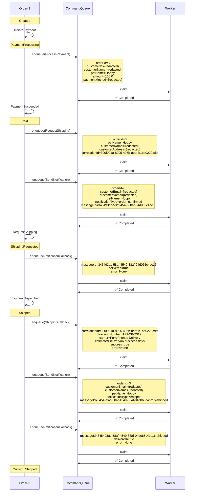
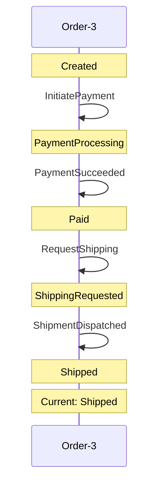
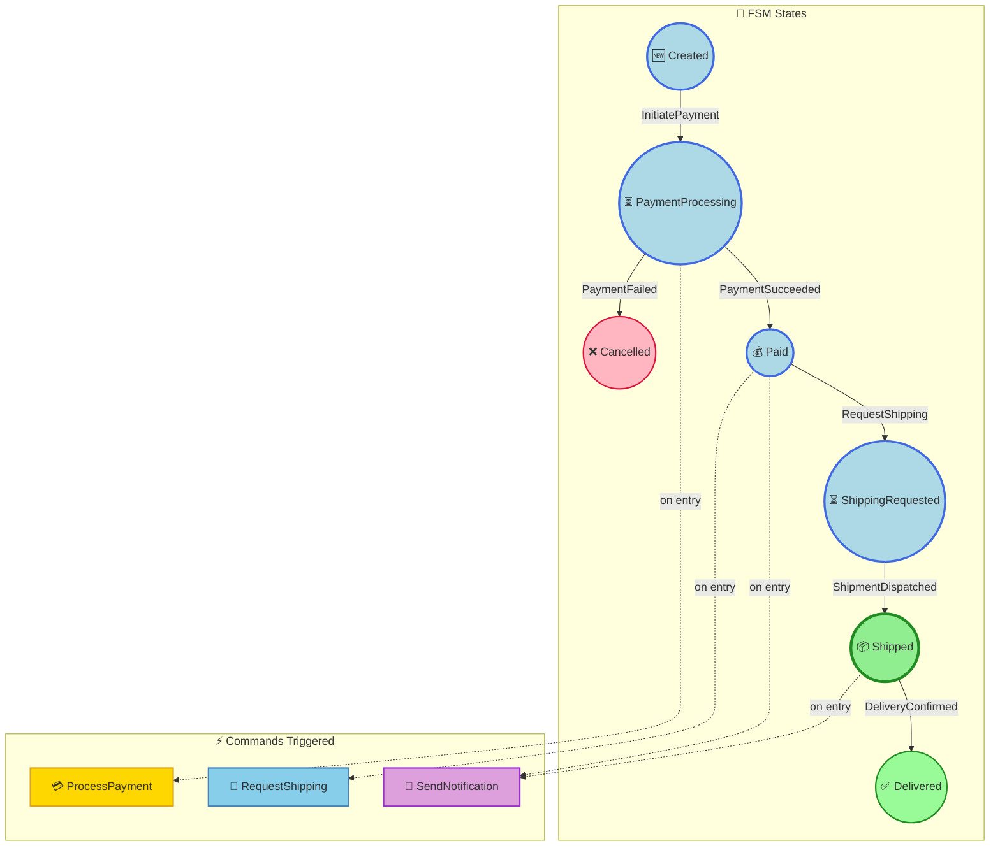

# Order 3 Execution Trace

**Final State:** Shipped

## Command Summary

- Completed: 7

## FSM + Commands Sequence Diagram

```mermaid
%%{init: {'themeCSS': '.noteText { text-align: left !important; }'}}%%
sequenceDiagram
    participant FSM as Order-3
    participant CQ as CommandQueue
    participant W as Worker

    Note over FSM: Created
    FSM->>FSM: InitiatePayment
    Note over FSM: PaymentProcessing
    FSM->>CQ: enqueue(ProcessPayment)
    Note right of CQ: orderId=3<br/>customerId={redacted}<br/>customerName={redacted}<br/>petName=Hoppy<br/>amount=100.0<br/>paymentMethod={redacted}
    CQ->>W: claim
    W->>CQ: ✅ Completed
    FSM->>FSM: PaymentSucceeded
    Note over FSM: Paid
    FSM->>CQ: enqueue(RequestShipping)
    Note right of CQ: orderId=3<br/>petName=Hoppy<br/>customerName={redacted}<br/>customerAddress={redacted}<br/>correlationId=300f991a-8295-495b-aeaf-b1be0229cdcf
    CQ->>W: claim
    W->>CQ: ✅ Completed
    FSM->>CQ: enqueue(SendNotification)
    Note right of CQ: orderId=3<br/>customerEmail={redacted}<br/>customerName={redacted}<br/>petName=Hoppy<br/>notificationType=order_confirmed<br/>messageId=345493ac-58af-4549-88af-04d065c4bc16
    CQ->>W: claim
    W->>CQ: ✅ Completed
    FSM->>FSM: RequestShipping
    Note over FSM: ShippingRequested
    FSM->>CQ: enqueue(NotificationCallback)
    Note right of CQ: messageId=345493ac-58af-4549-88af-04d065c4bc16<br/>delivered=true<br/>error=None
    CQ->>W: claim
    W->>CQ: ✅ Completed
    FSM->>FSM: ShipmentDispatched
    Note over FSM: Shipped
    FSM->>CQ: enqueue(ShippingCallback)
    Note right of CQ: correlationId=300f991a-8295-495b-aeaf-b1be0229cdcf<br/>trackingNumber=TRACK-2317<br/>carrier=FurryFriends Delivery<br/>estimatedDelivery=6 business days<br/>success=true<br/>error=None
    CQ->>W: claim
    W->>CQ: ✅ Completed
    FSM->>CQ: enqueue(SendNotification)
    Note right of CQ: orderId=3<br/>customerEmail={redacted}<br/>customerName={redacted}<br/>petName=Hoppy<br/>notificationType=shipped<br/>messageId=345493ac-58af-4549-88af-04d065c4bc16-shipped
    CQ->>W: claim
    W->>CQ: ✅ Completed
    FSM->>CQ: enqueue(NotificationCallback)
    Note right of CQ: messageId=345493ac-58af-4549-88af-04d065c4bc16-shipped<br/>delivered=true<br/>error=None
    CQ->>W: claim
    W->>CQ: ✅ Completed
    Note over FSM: Current: Shipped
```

## FSM-Only Sequence Diagram

```mermaid
sequenceDiagram
    participant FSM as Order-3
    Note over FSM: Created
    FSM->>FSM: InitiatePayment
    Note over FSM: PaymentProcessing
    FSM->>FSM: PaymentSucceeded
    Note over FSM: Paid
    FSM->>FSM: RequestShipping
    Note over FSM: ShippingRequested
    FSM->>FSM: ShipmentDispatched
    Note over FSM: Shipped
    Note over FSM: Current: Shipped
```

## Flowchart with Commands

```mermaid
flowchart TB
    subgraph FSM["🔄 FSM States"]
        direction LR
        Shipped(("📦 Shipped"))
        PaymentProcessing(("⏳ PaymentProcessing"))
        ShippingRequested(("⏳ ShippingRequested"))
        Delivered(("✅ Delivered"))
        Cancelled(("❌ Cancelled"))
        Paid(("💰 Paid"))
        Created(("🆕 Created"))
        Created -->|InitiatePayment| PaymentProcessing
        PaymentProcessing -->|PaymentSucceeded| Paid
        PaymentProcessing -->|PaymentFailed| Cancelled
        Paid -->|RequestShipping| ShippingRequested
        ShippingRequested -->|ShipmentDispatched| Shipped
        Shipped -->|DeliveryConfirmed| Delivered
    end

    subgraph Commands["⚡ Commands Triggered"]
        direction LR
        ProcessPayment["💳 ProcessPayment"]
        RequestShipping["🚚 RequestShipping"]
        SendNotification["📧 SendNotification"]
    end

    PaymentProcessing -.->|on entry| ProcessPayment
    Paid -.->|on entry| RequestShipping
    Paid -.->|on entry| SendNotification
    Shipped -.->|on entry| SendNotification

    style Delivered fill:#98FB98,stroke:#228B22,stroke-width:2px
    style Cancelled fill:#FFB6C1,stroke:#DC143C,stroke-width:2px
    style ProcessPayment fill:#FFD700,stroke:#DAA520,stroke-width:2px
    style RequestShipping fill:#87CEEB,stroke:#4682B4,stroke-width:2px
    style SendNotification fill:#DDA0DD,stroke:#9932CC,stroke-width:2px

    style Created fill:#ADD8E6,stroke:#4169E1,stroke-width:3px
    style ShippingRequested fill:#ADD8E6,stroke:#4169E1,stroke-width:3px
    style PaymentProcessing fill:#ADD8E6,stroke:#4169E1,stroke-width:3px
    style Shipped fill:#ADD8E6,stroke:#4169E1,stroke-width:3px
    style Paid fill:#ADD8E6,stroke:#4169E1,stroke-width:3px
    style Shipped fill:#90EE90,stroke:#228B22,stroke-width:4px
```
