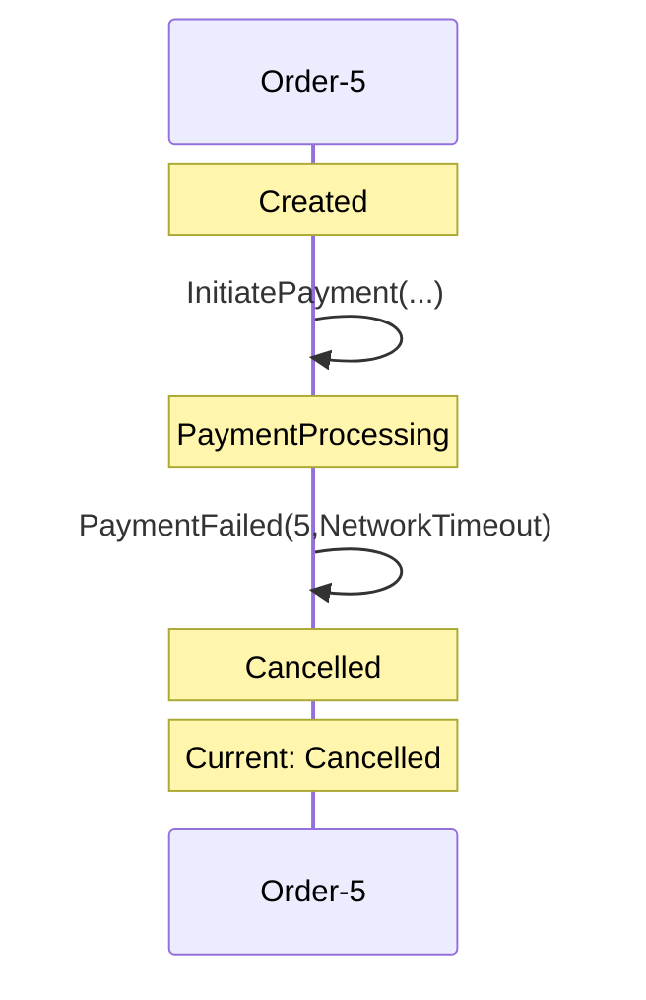
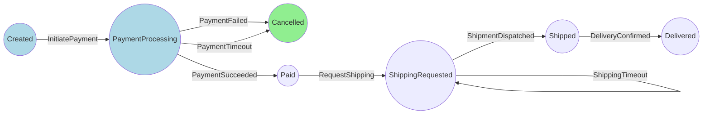

# Order 5 Execution Trace

**Final State:** Cancelled

## Sequence Diagram

```mermaid
sequenceDiagram
    participant FSM as Order-5
    Note over FSM: Created
    FSM->>FSM: InitiatePayment(...)
    Note over FSM: PaymentProcessing
    FSM->>FSM: PaymentFailed(5,NetworkTimeout)
    Note over FSM: Cancelled
    Note over FSM: Current: Cancelled

```

## Flowchart with Execution Path

```mermaid
flowchart LR
    Shipped((Shipped))
    PaymentProcessing((PaymentProcessing))
    ShippingRequested((ShippingRequested))
    Delivered((Delivered))
    Cancelled((Cancelled))
    Paid((Paid))
    Created((Created))

    Created -->|InitiatePayment| PaymentProcessing
    PaymentProcessing -->|PaymentSucceeded| Paid
    PaymentProcessing -->|PaymentFailed| Cancelled
    PaymentProcessing -->|PaymentTimeout| Cancelled
    Paid -->|RequestShipping| ShippingRequested
    ShippingRequested -->|ShipmentDispatched| Shipped
    ShippingRequested -->|ShippingTimeout| ShippingRequested
    Shipped -->|DeliveryConfirmed| Delivered

    style Created fill:#ADD8E6
    style PaymentProcessing fill:#ADD8E6
    style Cancelled fill:#ADD8E6
    style Cancelled fill:#90EE90

```
