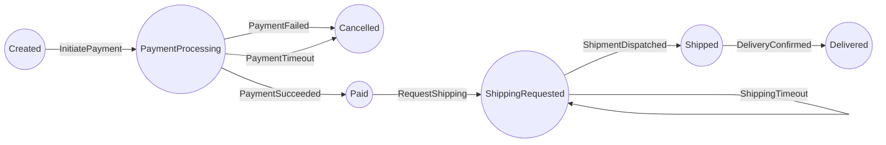

# Order FSM Structure

This diagram shows the Pet Store order lifecycle FSM.

## State Diagram (Mermaid)

```mermaid
stateDiagram-v2
    [*] --> Created
    Shipped --> Delivered: DeliveryConfirmed
    PaymentProcessing --> Paid: PaymentSucceeded
    PaymentProcessing --> Cancelled: PaymentFailed
    PaymentProcessing --> Cancelled: PaymentTimeout
    ShippingRequested --> Shipped: ShipmentDispatched
    ShippingRequested --> ShippingRequested: ShippingTimeout
    Paid --> ShippingRequested: RequestShipping
    Created --> PaymentProcessing: InitiatePayment
    note right of PaymentProcessing: timeout: 5m
    note right of ShippingRequested: timeout: 24h

```

## Flowchart (Mermaid)



## GraphViz DOT

```dot
digraph FSM {
    rankdir=LR;
    fontsize=12;
    node [shape=ellipse, fontsize=12];
    edge [fontsize=10];

    Shipped [label="Shipped"];
    PaymentProcessing [label="PaymentProcessing\n[timeout: 5m]", style=filled, fillcolor="#FFB6C1"];
    ShippingRequested [label="ShippingRequested\n[timeout: 24h]", style=filled, fillcolor="#FFB6C1"];
    Delivered [label="Delivered"];
    Cancelled [label="Cancelled"];
    Paid [label="Paid"];
    Created [label="Created"];
    __start__ [shape=point, width=0.2];
    __start__ -> Created;

    Created -> PaymentProcessing [label="InitiatePayment"];
    PaymentProcessing -> Paid [label="PaymentSucceeded"];
    PaymentProcessing -> Cancelled [label="PaymentFailed"];
    PaymentProcessing -> Cancelled [label="PaymentTimeout"];
    Paid -> ShippingRequested [label="RequestShipping"];
    ShippingRequested -> Shipped [label="ShipmentDispatched"];
    ShippingRequested -> ShippingRequested [label="ShippingTimeout"];
    Shipped -> Delivered [label="DeliveryConfirmed"];
}

```


