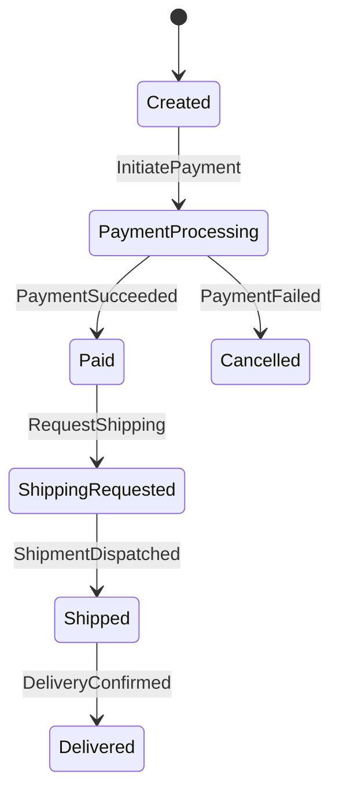
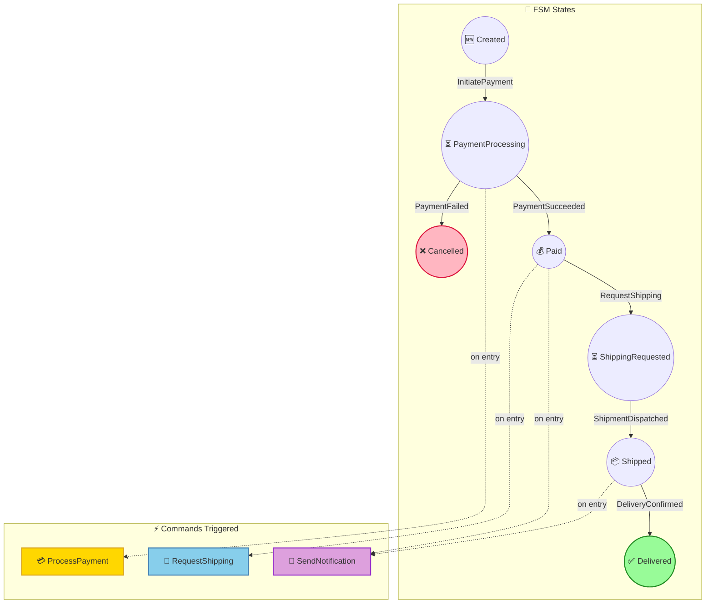

# Order FSM Structure

## State Diagram with Commands (Mermaid)

```mermaid
stateDiagram-v2
    [*] --> Created
    Shipped --> Delivered: DeliveryConfirmed
    PaymentProcessing --> Paid: PaymentSucceeded
    PaymentProcessing --> Cancelled: PaymentFailed
    ShippingRequested --> Shipped: ShipmentDispatched
    Paid --> ShippingRequested: RequestShipping
    Created --> PaymentProcessing: InitiatePayment
```

## FSM + Commands Flowchart

```mermaid
flowchart TB
    subgraph FSM["🔄 FSM States"]
        direction LR
        Shipped(("📦 Shipped"))
        PaymentProcessing(("⏳ PaymentProcessing"))
        ShippingRequested(("⏳ ShippingRequested"))
        Delivered(("✅ Delivered"))
        Cancelled(("❌ Cancelled"))
        Paid(("💰 Paid"))
        Created(("🆕 Created"))
        Created -->|InitiatePayment| PaymentProcessing
        PaymentProcessing -->|PaymentSucceeded| Paid
        PaymentProcessing -->|PaymentFailed| Cancelled
        Paid -->|RequestShipping| ShippingRequested
        ShippingRequested -->|ShipmentDispatched| Shipped
        Shipped -->|DeliveryConfirmed| Delivered
    end

    subgraph Commands["⚡ Commands Triggered"]
        direction LR
        ProcessPayment["💳 ProcessPayment"]
        RequestShipping["🚚 RequestShipping"]
        SendNotification["📧 SendNotification"]
    end

    PaymentProcessing -.->|on entry| ProcessPayment
    Paid -.->|on entry| RequestShipping
    Paid -.->|on entry| SendNotification
    Shipped -.->|on entry| SendNotification

    style Delivered fill:#98FB98,stroke:#228B22,stroke-width:2px
    style Cancelled fill:#FFB6C1,stroke:#DC143C,stroke-width:2px
    style ProcessPayment fill:#FFD700,stroke:#DAA520,stroke-width:2px
    style RequestShipping fill:#87CEEB,stroke:#4682B4,stroke-width:2px
    style SendNotification fill:#DDA0DD,stroke:#9932CC,stroke-width:2px
```

## GraphViz

```dot
digraph FSM {
    rankdir=LR;
    fontsize=12;
    node [shape=ellipse, fontsize=12];
    edge [fontsize=10];

    Shipped [label="Shipped"];
    PaymentProcessing [label="PaymentProcessing"];
    ShippingRequested [label="ShippingRequested"];
    Delivered [label="Delivered"];
    Cancelled [label="Cancelled"];
    Paid [label="Paid"];
    Created [label="Created"];
    __start__ [shape=point, width=0.2];
    __start__ -> Created;

    Created -> PaymentProcessing [label="InitiatePayment"];
    PaymentProcessing -> Paid [label="PaymentSucceeded"];
    PaymentProcessing -> Cancelled [label="PaymentFailed"];
    Paid -> ShippingRequested [label="RequestShipping"];
    ShippingRequested -> Shipped [label="ShipmentDispatched"];
    Shipped -> Delivered [label="DeliveryConfirmed"];
}
```
